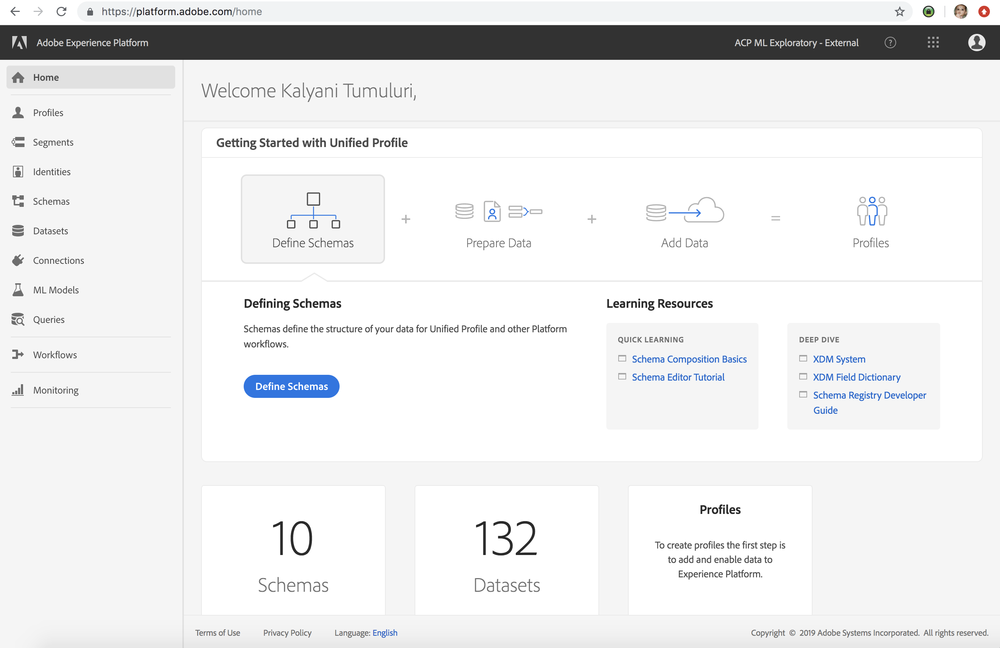

# _retail_ Sample App

Sample Scala Recipe using the retail data.

# Workflow
 
1. The recipe loads the dataset
2. Feature engineering is done on the data so that the data can be used for machine learning training 
3. The feature pipeline defines the stages with the Gradient Boosting Regressor as the chosen model
4. This pipeline is used to fit the training data and the trained model is created
5. The model is transformed with the scoring dataset
6. Interesting columns of the output are then selected and saved back to the platform with the associated data

# Prerequisites

To run the recipe in any org, we would need the schema of the dataset, the input dataset, 
output schema and empty output dataset uploaded to the platform UI. For setting this up, use the bootstrap script 
within `/acp-data-services-dsw-reference/bootstrap`
Get the tenant id from running the `Curl command to get the tenant id` and replace the value of the key `tenant_id` in `pipelineservice.json` 
If you got the engine artifact from the bootstrap script, jump to the section `Video for Training, Scoring and 
Saving data` 

### Curl command to get the tenant id

```
    curl -X GET \
      https://platform.adobe.io/data/foundation/schemaregistry/stats \
      -H 'Authorization: [Bearer token] \
      -H 'x-api-key: [api key]' \
      -H 'x-gw-ims-org-id: [imsorg id]'
``` 
 
 Sample response:
 
 ```
 {
     "imsOrg": "20656D0F5B9975B20A495E23@AdobeOrg",
     "tenantId": "acpmlexploratoryexternal", - This is tenant Id that we are interested in
     "counts": {
         "schemas": 69,
         "mixins": 60,
         "datatypes": 0,
         "classes": 76,
         "unions": 0
     },
     "recentlyCreatedResources": [
         ...
     ],
     "recentlyUpdatedResources": [
         ...
     ],
     "classUsage": [
     	...
     ]   
 }
 ```

# Steps to run training and scoring jobs
git clone this repository from `https://github.com/adobe/experience-platform-dsw-reference`

cd to recipes/scala and run `build.sh` 

```
sh ./build.sh
```

This generates a fat jar and is saved in the target directory of the project. 
Use this jar and go to platform UI `https://platform.adobe.com/` and run training and scoring. 
Please look at the video `Video for Training, Scoring and Saving data`

### Video for Training, Scoring and Saving data
[](https://youtu.be/Ob_o0FgRXU4)
Make sure to select runtime as Spark when running the scenario through the UI.

# Sample Config json
        [
          {
            "name": "train",
            "parameters": [
              {
                "key": "learning_rate",
                "value": "0.1"
              },
              {
                "key": "n_estimators",
                "value": "100"
              },
              {
                "key": "max_depth",
                "value": "3"
              },
              {
                "key": "ACP_DSW_INPUT_FEATURES",
                "value": ""
              },
              {
                "key": "ACP_DSW_TARGET_FEATURES",
                "value": ""
              },
              {
                "key": "ACP_DSW_FEATURE_UPDATE_SUPPORT",
                "value": false
              },
              {
                "key":"tenant_id",
                "value": "_<tenant_id>"
              },
              {
                "key": "ACP_DSW_TRAINING_XDM_SCHEMA",
                "value": ""
              },
              {
                "key": "timeframe",
                "value": "600000000"
              },
              {
                "key": "evaluation.labelColumn",
                "value": "weeklySalesAhead"
              },
              {
                "key": "evaluation.scalingColumn",
                "value": "weeklySalesScaled"
              },
              {
                "key": "evaluation.predictionColumn",
                "value": "prediction"
              },
              {
                "key": "evaluation.trainRatio",
                "value": "0.8"
              },
              {
                "key": "evaluation.metrics",
                "value": "MAPE,MAE,RMSE,MASE"
              }
            ]
          },
          {
            "name": "score",
            "parameters": [
              {
                "key":"tenant_id",
                "value": "_<tenant_id>"
              },
              {
                "key": "timeframe",
                "value": "600000000"
              },
              {
                "key": "evaluation.predictionColumn",
                "value": "prediction"
              },
              {
                "key":"ACP_DSW_SCORING_RESULTS_XDM_SCHEMA",
                "value":""
              }
            ]
          }
        ]
